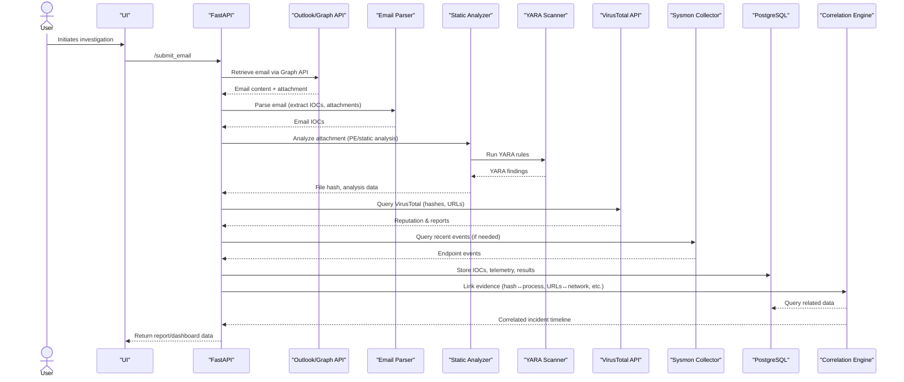

# MALCIE Architecture

**Summary:** MALCIE is built as a containerized, microservice-based application. Core components include a FastAPI backend, a React/TypeScript frontend, a PostgreSQL database, object storage for artifacts, and several specialized workers and connectors. Authentication (OAuth2/JWT) secures the API.  The system ingests emails via an API (Microsoft Graph primary, Gmail optional), performs malware analysis and IOC enrichment, and correlates with endpoint telemetry (Sysmon). It is intended to run in Docker/Kubernetes.

 *Figure 1: Example design sketch illustrating how microservices (containers) can organize MALCIE’s components.* 

## Component Diagram

```mermaid
flowchart LR
  subgraph MALCIE Backend
    WebAPI[FastAPI Web API]
    Parser[Email Parser Worker]
    Analyzer[Static Malware Analyzer]
    YARAScan[YARA Scanner]
    TI[VirusTotal Threat Intel]
    Telemetry[Sysmon Telemetry Ingest]
    Correlator[Evidence Correlation Engine]
    Postgres[(PostgreSQL DB)]
    Storage[(Object Storage)]
  end
  subgraph Frontend
    Client[React + TypeScript Frontend]
  end
  EmailAPI[Email API Ingestion<br/>(Graph/Gmail)] --> WebAPI
  Auth(OAuth2/JWT Auth) -.-> WebAPI
  WebAPI --> Parser
  WebAPI --> Analyzer
  Analyzer --> YARAScan
  WebAPI --> TI
  WebAPI --> Telemetry
  Parser --> Correlator
  YARAScan --> Correlator
  TI --> Correlator
  Telemetry --> Correlator
  Correlator --> Postgres
  Correlator --> Storage
  Client --> WebAPI
```

- **Email API Ingestion:** (Microsoft Graph Mail API as primary; Gmail API optional) pulls suspicious messages into MALCIE.  
- **FastAPI Backend:** Implements the REST API, queues analysis jobs, and exposes endpoints for the frontend. FastAPI is a high-performance Python framework for building APIs.  
- **Workers:** 
  - **Email Parser:** Extracts URLs, domains, message content, and attachments from an email.  
  - **Static Malware Analyzer:** Computes hashes, PE headers, strings, imports, entropy, etc.  
  - **YARA Scanner:** Applies YARA rules to detect known malware patterns.  
- **Threat Intelligence Connector:** Calls the VirusTotal v3 API to look up IOCs (file hashes, URLs, domains, IPs) and retrieve analysis reports.  
- **Endpoint Telemetry Collector:** Ingests Windows Sysmon events (process/network events) from a monitored host. Sysmon provides detailed logs of process creation, network connections, file and registry changes.  
- **Correlation Engine:** Links the pieces: e.g., finds if a file hash from the malware scan corresponds to a process execution in the telemetry. It forms the core incident narrative.  
- **Database (PostgreSQL):** Stores metadata, analysis results, IOC records, and telemetry logs. PostgreSQL is a powerful open-source relational DB with a reputation for reliability and performance.  
- **Object Storage:** Holds potentially large artifacts (email files, reports). It can be an S3-compatible bucket or similar.  

## Sequence Flow



## Repository Structure

A clean, organized repo might look like:

| Path/Filename               | Description                                |
|----------------------------|--------------------------------------------|
| `src/backend/`             | Python/FastAPI service code                |
| `src/frontend/`            | React + TypeScript app code                |
| `infra/`                   | Deployment configs (K8s manifests, Terraform, etc.) |
| `scripts/`                 | Utility scripts (DB migrations, data loaders) |
| `tests/`                   | Automated tests (e.g. pytest, Jest)        |
| `docs/`                    | Documentation (architecture, API specs)    |
| `.github/workflows/ci.yml` | CI/CD pipeline (GitHub Actions)            |
| `Dockerfile`               | Dockerfile for backend service             |
| `docker-compose.yml`       | Compose setup (DB, backend, frontend)      |
| `.env.example`             | Example environment variables file         |
| `.gitignore`               | Git exclusions (node_modules, cache, etc.) |
| `README.md`                | Overview and setup instructions            |
| `LICENSE`                  | Project license                            |

## Technology Stack

- **Language & Framework:** Python 3.12+ with **FastAPI** (v0.112) for the web API; **Node.js** (LTS, e.g. v18 or v20) with **React 19.2** (or latest) and TypeScript for the frontend. React is “the library for web and native user interfaces”. TypeScript adds type-safe syntax to JavaScript.  
- **Database:** PostgreSQL 15+ (or 18), a reliable open-source relational DB.  
- **Email Ingestion:** Microsoft Graph Mail API (v1.0) for Outlook/Office365. (OAuth2 delegated flow, least-privilege `Mail.Read` scope.) Gmail API optional.  
- **Threat Intel:** VirusTotal API v3 for file/URL/domain reputation.  
- **Endpoint Telemetry:** Microsoft Sysmon (built-in) for Windows event logging.  
- **Containerization:** Docker (Engine v23+) for building images. Docker Compose for local dev.  
- **Orchestration:** Kubernetes (v1.28+) to deploy scalable services. Helm charts (optional) or plain YAML.  
- **CI/CD:** GitHub Actions for automated testing and builds.   
- **Authentication:** OAuth2/OIDC (e.g. via Auth0 or Azure AD) issuing JWT tokens. FastAPI has built-in support for OAuth2 and JWT.  
- **Other Tools:** SQLAlchemy or SQLModel for DB ORM, Pydantic for data models (built into FastAPI), YARA (via `yara-python`) for scanning. ESLint/Prettier for frontend linting.

**Security & Hardening:**  
All secrets (API keys, DB passwords) are read from environment variables or a secure vault. OAuth2 tokens (Azure AD/Graph) use short-lived tokens and refresh as needed. The app runs with least privilege: e.g. Graph API credentials with only mail-read scope. Malware analysis workers should handle untrusted files safely (e.g. in an isolated container, disabled exec). Database connections use SSL. Deploy with RBAC in Kubernetes, and network policies to restrict unnecessary access. All containers and images use minimal base images (e.g. Debian-slim) and automated vulnerability scanning.  

**Rationale:** Each technology is a popular, well-supported choice: FastAPI for Python APIs, React for dynamic UIs, PostgreSQL for structured data, Graph API for email access, VirusTotal for threat intel, and Sysmon for endpoint visibility. Docker/Kubernetes enable consistent deployment, and GitHub Actions provides built-in CI/CD. 

## Development & Deployment

- **Prerequisites:** Install Docker (23.x), Docker Compose, Node.js (LTS), and Python 3.12+.  
- **Local Dev:** Copy `.env.example` to `.env` and fill in secrets (Graph API credentials, VirusTotal API key, DB URL, JWT secret). In the project root: 
  ```
  git clone <repo>
  cd MALCIE
  cp .env.example .env
  docker-compose up -d --build
  ```
  This starts PostgreSQL, the FastAPI backend (at port 8000), and the React frontend (port 3000).  
- **Frontend:** In `src/frontend/`, run `npm install`, then `npm run start` (opens on localhost:3000) for development. To build for production, use `npm run build`.  
- **Backend:** Uses Uvicorn/Gunicorn. Dockerfile builds the FastAPI app. See example below. After `docker-compose up`, the backend is at `http://localhost:8000`. Swagger UI is available at `/docs`.  
- **Testing:** Backend: `pytest` (in `tests/`). Frontend: `npm test` (Jest). Linting: `flake8`/`black` for Python; `eslint`/`prettier` for JS.  
- **Kubernetes:** Apply manifests in `infra/k8s/`, e.g.:  
  ```
  kubectl apply -f infra/k8s/deployment.yaml
  kubectl apply -f infra/k8s/service.yaml
  ```  
  (Use a cloud or on-prem cluster. Configure secrets via Kubernetes Secrets for API keys and JWT.)  
- **CI Pipeline:** The `.github/workflows/ci.yml` should run on pushes/PRs to main, installing dependencies, linting, and running tests for both backend and frontend. It can also build Docker images and push to a registry.

**Sample Configuration Snippets:**  
<details>
<summary>**Dockerfile (backend)**</summary>

```dockerfile
FROM python:3.12-slim
WORKDIR /app
COPY requirements.txt .
RUN pip install --no-cache-dir -r requirements.txt
COPY src/backend/ .
CMD ["uvicorn", "main:app", "--host", "0.0.0.0", "--port", "8000"]
```
*(Expose port 8000, set appropriate ENV for credentials.)*  

**docker-compose.yml:**  
```yaml
version: '3.8'
services:
  db:
    image: postgres:15
    environment:
      - POSTGRES_USER=malcie
      - POSTGRES_PASSWORD=secret
      - POSTGRES_DB=malciedb
    volumes:
      - pgdata:/var/lib/postgresql/data
  backend:
    build: .
    ports:
      - "8000:8000"
    environment:
      - DATABASE_URL=postgresql://malcie:secret@db/malciedb
      - VT_API_KEY=${VT_API_KEY}
      - JWT_SECRET=${JWT_SECRET}
      - GRAPH_CLIENT_ID=${GRAPH_CLIENT_ID}
      # etc.
    depends_on:
      - db
  frontend:
    build: ./src/frontend
    ports:
      - "3000:3000"
    environment:
      - REACT_APP_API_URL=http://localhost:8000
    depends_on:
      - backend

volumes:
  pgdata:
```

**.gitignore (examples):**  
```
# Python caches
__pycache__/
*.py[cod]
venv/
# Node
node_modules/
build/
dist/
# Environment
.env
# Docker
docker-compose.yml
# Logs
*.log
```
</details>

## References

- FastAPI (docs): “modern, high-performance… web framework”  
- React (official): “The library for web and native user interfaces”  
- PostgreSQL (homepage): “powerful, open source… database… reliability, robustness”  
- Microsoft Graph Mail API: authorized access to Outlook mail  
- VirusTotal API v3: default REST API for file/URL scans  
- Sysmon (Windows): logs process creations, network connections  
- Docker: container platform for building and running apps  
- Kubernetes: “open source container orchestration engine”  
- GitHub Actions: “Automate… your software development workflows”  

The above stack and architecture form MALCIE’s design. The emphasis is on **modular, testable components** and secure integration of each piece (email, malware scan, intelligence, telemetry) into one cohesive workflow. All development and deployment steps are documented in code and scripts, ensuring the system can be built and run end-to-end in a realistic environment.