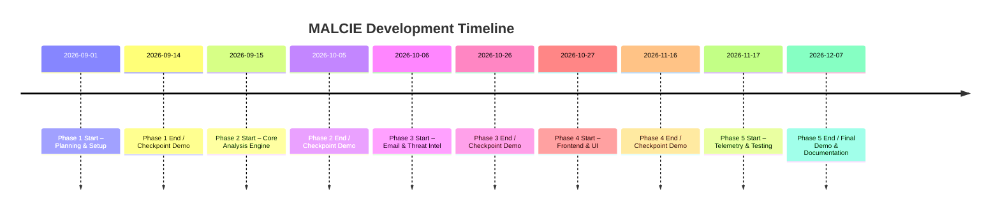

# MALCIE Development Phases

**Executive Summary:** The MALCIE project will be developed in **five phases** over approximately 12–14 weeks, each building upon the last.  Phase 1 focuses on planning, architecture, and environment setup; Phases 2–4 implement the core system (static analysis engine, email/threat integrations, and front-end UI, respectively); Phase 5 integrates endpoint telemetry and final testing.  Each phase has clearly defined goals, deliverables (code, documentation, tests, deployment scripts), and measurable acceptance criteria.  Key checkpoints and demos are scheduled at phase boundaries to validate progress.  Malicious files will only be handled in isolated environments (no live execution on production or dev machines) with rollback plans for errors.  The following sections detail each phase, roles, risks, and timeline.

## Development Phases Overview

| **Phase**         | **Duration** | **Key Goals & Activities**                                                                     | **Deliverables (Code / Docs / Tests / Infra)**                                       | **Features (MVP vs Future)**                                            |
|-------------------|-------------:|-----------------------------------------------------------------------------------------------|--------------------------------------------------------------------------------------|-------------------------------------------------------------------------|
| **1. Planning & Setup**    | 1–2 weeks    | Finalize scope, architecture, and requirements. Setup repo, CI/CD pipeline, database.         | – Project architecture and design documents – Repository skeleton (FastAPI project, React skeleton) – `.gitignore`, `Dockerfile`, CI config – Initial DB schema (empty) and migrations – Draft acceptance tests checklist | MVP Planning (defined PRD)                                                |
| **2. Core Analysis Engine**| 3 weeks     | Implement file upload API and static malware analysis pipeline. Compute hashes and PE details, run YARA, extract IOCs and store in DB. | – Python analysis service (FastAPI) with endpoints for file submission and report retrieval – Integration of `pefile` for PE parsing – `yara-python` integration for YARA scanning – Database models and migrations (SQLAlchemy + PostgreSQL) – Unit tests for analysis logic (pytest) – API docs (Swagger/OpenAPI) | - MVP: Static analysis, IOC extraction  - Future: Automated CVE lookup, unpackers |
| **3. Email & Threat Integration**| 3 weeks | Add email ingestion and enrichment. Use Microsoft Graph API to fetch test emails/O365 messages, parse attachments. Call VirusTotal API to enrich hashes, domains, URLs. | – Email fetch service using Microsoft Graph (OAuth2) – Email parser (Python `email` library) for headers, body, attachments – VirusTotal client module (REST calls via HTTPX) – Extended DB schema for emails and IOCs – Integration tests covering email parse and intel lookup – Configuration docs for API keys/environments | - MVP: Email fetch & parse, basic VT reputation  - Future: Multi-provider support (Gmail), additional TI sources |
| **4. Frontend & Correlation**| 3 weeks    | Develop React UI for incident investigation. Display email, analysis, IOCs, threat info. Implement evidence correlation logic (e.g. match hash → process events). Provide incident timeline and risk scoring in UI. | – React/TypeScript SPA (with component library) for dashboards and detail views – REST API endpoints for UI data (FastAPI) – Incident and timeline views, evidence linking UI – Correlation service (backend logic joining data sources) – Frontend unit and integration tests (Jest/React Testing Library) – UI/UX documentation (wireframes/screenshots) | - MVP: Incident dashboard, basic timeline & risk report  - Future: Drag-drop IOC search, advanced visualizations |
| **5. Telemetry & Final Testing**| 2–3 weeks | Integrate endpoint telemetry (Sysmon logs). Ingest sample Sysmon events, correlate with analysis results (e.g. file execution, network calls). Run full end-to-end tests and refine. Finalize documentation and deployment. | – Sysmon collector/ingestion service (parse XML/JSON logs) and DB storage – Correlation rules expanded to include process/file/network events – End-to-end test scenarios (mock attacks) and results – Deployment scripts (Docker Compose, Kubernetes manifests if used) – Final user/developer documentation, README update – Demo-ready dataset and scripts | - MVP: Endpoint events correlation, final report generation  - Future: Live monitoring, automated response scripts |

**Table:** Summary of development phases, durations, goals, deliverables, and which features belong to the MVP baseline versus future enhancements.

## Phase Details

### Phase 1: Planning & Setup (Weeks 1–2)
- **Goals:** Finalize MALCIE scope and architecture; choose core technologies; set up the development and test environment. Define MVP features and acceptance criteria.  
- **Key Tasks:** Refine PRD and high-level design; create project skeleton (FastAPI + React boilerplate); configure Git, Docker, and CI pipelines; set up a PostgreSQL instance. Sketch initial ER and DFD models.  
- **Deliverables:** Project architecture and schema diagrams; technical design doc; initialized Git repo with `.gitignore`, `Dockerfile`, `docker-compose.yml`; FastAPI starter app and React app (empty UI); database migrations script; placeholder config for Microsoft Graph and VirusTotal API keys; draft acceptance test list.  
- **Acceptance Criteria:** Completed design docs reviewed; repository builds successfully and API server starts; DB connects; initial “Hello World” endpoint and UI page load; environment variables and secrets mechanism in place; demo: show architecture and confirm baseline stack.  
- **Risks & Mitigations:** *Risk:* Unclear requirements → Review PRD with stakeholders early. *Mitigation:* Use prototype storyboards. *Risk:* Tooling/setup issues (e.g. Docker networking) → Use well-documented templates; allocate time for environment debugging.  
- **Roles:** Lead Architect (design), DevOps Engineer (environment setup), Backend Developer (framework setup), Project Manager.

### Phase 2: Core Analysis Engine (Weeks 3–5)
- **Goals:** Build the malware analysis backend. Implement file upload API, static analysis (hashing, PE parsing, string extraction), IOC extraction, and YARA scanning. Store all findings in the database.  
- **Key Tasks:** Develop FastAPI endpoints (e.g. `POST /api/analyze-file`) to accept files. Integrate the `pefile` library to read PE headers and sections. Compute SHA-256 hashes. Extract imports, strings, and entropy. Run user-defined YARA rules using `yara-python`. Extract IPs, URLs, domains from content. Save results (hashes, metadata, matched YARA rules) into PostgreSQL via SQLAlchemy.  
- **Deliverables:** Completed analysis service code (FastAPI app) and ORM models; test malware samples (benign or known malware for dev/testing only, not committed to repo); YARA rule directory (e.g. `rules/malware.yar`); unit tests validating analysis outputs on sample binaries; API documentation (OpenAPI JSON).  
- **Acceptance Criteria:** Static analysis correctly processes provided test samples (e.g. expected hash and PE info match). At least 80% unit test coverage on analysis module. The API should handle invalid/malformed files gracefully (return errors, not crash). Demo: Upload a sample `.exe` via API and display parsed fields and YARA results in the CLI or UI.  
- **Risks & Mitigations:** *Risk:* Large binary processing time → set size limits, stream file reads. *Risk:* Malformed files cause exceptions → add robust try/catch and validate file headers. *Risk:* Insufficient YARA rule quality → start with minimal rules, iterate.  
- **Roles:** Backend Developers (Python, malware analysis), QA/Testers (write test cases), Security Lead (malware analysis guidelines).

### Phase 3: Email & Threat Integration (Weeks 6–8)
- **Goals:** Enable MALCIE to retrieve and parse emails, and enrich IOCs via external intelligence.  
- **Key Tasks:** Configure Microsoft Graph API OAuth flow (using an Azure AD app) to allow MALCIE to fetch emails (inbox or phishing/test folder). Implement a service that queries Graph endpoints (e.g. `GET /me/messages`). Extract email metadata (sender, subject, timestamps) and parse MIME content with Python’s `email` library to get attachments and URLs. After static analysis of any attachment, query the VirusTotal API (v3) for the file hash, URLs, and domains. Handle API keys via secure config. Store email entries and returned reputation data in the database.  
- **Deliverables:** Code for email polling or webhooks (Microsoft Graph) and parsing logic; data models for emails and attachments; VirusTotal client module; integration tests (e.g. using a test mailbox or sample EML files); documentation on obtaining and storing API credentials; expanded database schema/migrations.  
- **Acceptance Criteria:** MALCIE can connect to a test email account and retrieve at least one new message. Attachments extracted and hashed. Queries to VirusTotal complete (or time out gracefully). IOC enrichment results (e.g. VT maliciousness score) appear in DB. Demo: Fetch a sample phishing email (or `.eml` file), show parsed contents and highlight known bad indicators with VirusTotal data.  
- **Risks & Mitigations:** *Risk:* OAuth misconfiguration → follow Microsoft’s guides for Graph API (do token testing beforehand). *Mitigation:* Use Microsoft Graph documentation. *Risk:* API rate limits (Graph and VT) → implement exponential backoff, caching of results, and respect quotas. *Risk:* Privacy/security of mailbox credentials → use least-privileged app and token storage.  
- **Roles:** Backend Developer (API integration), Security Analyst (manage test mailbox, review indicators), DevOps (secrets management), QA (email processing tests).

### Phase 4: Frontend & Correlation (Weeks 9–11)
- **Goals:** Create a user interface for analysts and implement the evidence-correlation and reporting logic.  
- **Key Tasks:** Build a React front end using TypeScript. Develop pages/components for: listing incidents, viewing an incident with its emails, artifacts, IOCs, and evidence timeline. Consume the FastAPI JSON endpoints for data. In the backend, implement correlation rules: link emails to attachments, attachments to hashes to endpoint events. Compute risk scores (e.g. count of hits, reputation levels).  
- **Deliverables:** Complete React app with routes (e.g. `/incidents`, `/incidents/{id}`); styled tables or charts for IOCs and YARA findings; timeline component showing sequential events; API endpoints for incident data; example incident data (test fixtures); front-end unit/integration tests. UI documentation/screenshots for user guide.  
- **Acceptance Criteria:** The UI can list at least one mock incident and drill down to view details. Data from previous phases (emails, analysis results, VT info) displays correctly. Demonstrate correlation by selecting an IOC and highlighting related items (e.g. clicking a hash shows associated processes). Demo: Show the workflow in UI from phishing email to final incident report.  
- **Risks & Mitigations:** *Risk:* Overly complex UI → start with minimal design, incrementally enhance. *Mitigation:* Use component libraries (e.g. Material-UI) for consistent layout. *Risk:* Data modeling mismatches between front/back → define clear API contracts (using Pydantic models). *Risk:* Time-consuming front-end bugs → include UI tests and code reviews.  
- **Roles:** Frontend Developer (React/TS), UX Designer (if available, else dev handles), Backend Developer (API endpoints), QA (UI testing).

### Phase 5: Telemetry & Final Testing (Weeks 12–14)
- **Goals:** Ingest endpoint telemetry and perform full-system testing. Prepare for deployment and finalize documentation.  
- **Key Tasks:** Set up Sysmon on a test Windows VM to generate telemetry (process, file, registry, network events). Implement a log collector service to receive or read Sysmon events (e.g. via signed XML/JSON or an input folder). Normalize and store events in the database. Extend correlation: e.g. if a malware file executes, link its hash to a process creation event. Update risk logic (e.g. “High” if suspicious activity logged). Create and run end-to-end test scenarios: simulate a phishing-to-malware execution chain. Resolve any bugs. Write final docs (user manual, deployment guide, developer notes). Prepare a presentation/demo dataset.  
- **Deliverables:** Telemetry ingestion code (service or scripts); updated database tables for events; full test suite (including integration tests simulating attacks); performance tests to ensure reasonable response times; final Docker/VM images or manifests; complete documentation (README, developer wiki, Phase summary). A demo script or checklist for reviewers.  
- **Acceptance Criteria:** Telemetry events from a sample Windows run are captured and correlate with an analysis record (e.g. “file A.exe executed, event shows process start”). The system can process a full workflow from email to report without errors. All critical bugs fixed. Documentation is up-to-date. Demo: Run a canned scenario (e.g. open phishing email, run attached benign executable with Sysmon enabled) and show MALCIE’s investigation report.  
- **Risks & Mitigations:** *Risk:* Log volume and noise → filter events by hash or known artifacts to avoid overload. *Risk:* Late integration issues → allocate time for fixes. *Risk:* Missing features (e.g. dynamic analysis) → ensure MVP goals are met, defer extras.  
- **Roles:** Backend Developer (telemetry parser), QA/Test Engineer (attack simulation), DevOps (environment for Sysmon and collection), Documentation Lead, Project Manager.

## Project Timeline

Below is a high-level schedule in Mermaid timeline format.  Each phase’s start and end dates are approximate but give a sense of the project flow:

**Checkpoints & Demos:** At the end of each phase, the team should demonstrate the implemented features to stakeholders. For example, after Phase 2 the demo might upload and analyze a test binary and display results. The acceptance criteria above serve as “doit” conditions. Each checkpoint should include test results logs.

**Rollback and Malware Handling Safety:**  No malware samples or secrets are to be committed to Git. All analysis must be static unless a secure sandbox is specifically configured. If an analysis or deployment step fails (e.g. database migration), rollback via version control or Docker image snapshots.  All CI/CD should run on isolated test environments.  In case of unexpected behavior (e.g. corrupted data), the team will revert to the last known-good version from Git or backup.

## Phases Deliverables at a Glance

| **Phase** | **Duration** | **Code** | **Documentation** | **Testing** | **Deployment / Infra** |
|-----------|-------------:|----------|-------------------|-------------|------------------------|
| 1. Planning & Setup | 1–2 wks | Project skeleton (FastAPI, React), CI/CD config | Architecture doc, requirements Environment setup guide | Smoke test (API start, DB connect) | Dockerfiles, Docker Compose template |
| 2. Static Analysis Engine | 3 wks | File-analysis service (pefile, YARA) | API spec (OpenAPI) Design notes (PE parsing) | Unit tests for analysis; static analysis of sample files | Initial DB migrations |
| 3. Email & Threat Intel | 3 wks | Email fetcher (MS Graph) and VT client | Integration guide (Graph API, VT API) Data model docs | Tests for email parsing and VT lookups | Email test account configuration |
| 4. Frontend & UI | 3 wks | React UI components, additional APIs | UI usage guide (screenshots) Correlation logic design | Frontend tests (Jest) and API integration tests | Web server (optional) deployment config |
| 5. Telemetry & Final | 2–3 wks | Sysmon log ingestion, final report generator | End-user manual Developer setup guide Release notes | End-to-end scenario tests; performance testing | Final deployment scripts; Docker/K8s manifest |

**Legend:** MVP features are implemented in Phases 2–5; “Future” enhancements (outside MVP) are noted above.  The project uses a **FastAPI** backend, a **PostgreSQL** database, a **React**+TypeScript frontend, and libraries like `pefile` and `yara-python`.  Email integration uses Microsoft Graph API, and threat intelligence comes via VirusTotal’s API. 

**Roles Needed:** The (unspecified-size) team should cover: Back-end Engineers (Python/FastAPI, malware analysis), Front-end Engineers (React), a Data Engineer/DBA (PostgreSQL, syslog), DevOps (containerization, CI/CD), QA/Testers (automation, security), and a Project Lead/Manager. Some roles may be combined in a small team.

**Constraints & Notes:** The timeline assumes uninterrupted development and timely availability of credentials (e.g. Graph API, VirusTotal key). Scope is tightly controlled; features outside the core investigation workflow (e.g. ML models, full EDR) are deferred. Success is measured by completing the MVP functionality within schedule, meeting acceptance criteria at each checkpoint, and producing a demonstrable end-to-end malware investigation workflow.

**Sources:** We selected FastAPI as the high-performance web framework, React for UI, PostgreSQL as a robust DB, `pefile` for PE parsing, `yara-python` for YARA rules, Microsoft Graph for email integration, and VirusTotal’s REST API for IOC intelligence. These choices are based on official documentation and industry practice.